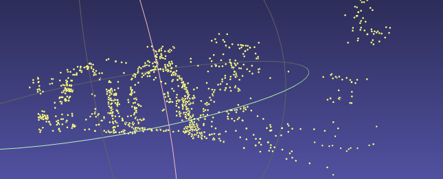

# structure from motion 实验报告

> 成员
>
> 龚逸青：201712809008
>
> 方家琦：201712512018

## 实验环境

- python 3.6
  - opencv-python 3.4.2.16
  - numpy 1.18.1

## 实现流程

- 获取两张图片的$sift$特征，获取特征匹配，使用$ransac$估计$fundamental Matrix$。

  **fundamental Matrix 计算方法**

  选出对应点后，使用如下方式计算
  $$
  \begin{bmatrix} x'_i & y'_i & 1 \end{bmatrix}
  \begin{bmatrix}f_{11} & f_{12} & f_{13} \\ f_{21} & f_{22} & f_{23} \\ f_{31} & f_{32} & f_{33} \end{bmatrix}
  \begin{bmatrix} x_i \\ y_i \\ 1 \end{bmatrix}
  $$

  $$
  \begin{equation}x_i x'_i f_{11} + x_i y'_i f_{21} + x_i f_{31} + y_i x'_i f_{12} + y_i y'_i f_{22} + y_i f_{32} +  x'_i f_{13} + y'_i f_{23} + f_{33}=0\end{equation}
  $$

  
  $$
  \begin{bmatrix} x_1 x'_1 & x_1 y'_1 & x_1 & y_1 x'_1 & y_1 y'_1 & y_1 &  x'_1 & y'_1 & 1 \\ \vdots & \vdots & \vdots & \vdots & \vdots & \vdots & \vdots & \vdots & \vdots \\ x_m x'_m & x_m y'_m & x_m & y_m x'_m & y_m y'_m & y_m &  x'_m & y'_m & 1 \end{bmatrix}\begin{bmatrix} f_{11} \\ f_{21} \\ f_{31} \\ f_{12} \\ f_{22} \\ f_{32} \\ f_{13} \\f_{23} \\ f_{33}\end{bmatrix} = 0
  $$
  通过解上面这个方程得到$fundamental Matrix$。

  上面这个方程可以使用奇异值分解求解最小二乘，假设上述方程为 $Ax = 0$

  对$A$做奇异值分解，$A = USV^T$，$V$的最后一列就是我们所求的$fundamental Matrix$。

  上面的方法求出来的矩阵不一定满足秩为2的限制，所以使用$svd$分解强制使其秩为2。

- 求解 $essential Matrix$

  上一步求出$fundamental Matrix$后可以通过下面这个公式直接推出：
  $$
  E=K^TFK
  $$
  其中 $K$是相机的内参矩阵。

  由于$essential Matrix$的秩也为2，同时还要满足两个特征值的值相等。因此，也使用$svd$分解后使其强制满足上述条件。

- 求解$R,t$

  对$essential Matrix$做奇异值分解， $E=USV^T$

  $t$的值为矩阵$U$的最后一列，或是最后一列取负。

  $R$的值为 $UWV^T$或者 $UW^TV^T$

  两个变量各有两种取值，共有四种取值。但只有一种取值是正确的，满足实际的投影情况的。

  我们使用以下方法验证哪一组$R,$t是正确的

  对每一组$R,t$使用三角化求出三维空间坐标，三维空间坐标应满足$z$坐标不小于0。根据此条件可以对异常点进行计数，异常点最少的对应的就是正确的$R,t$。

- 三角化

## 实验结果分析

### 第一组图片的结果

第一张图片是使用cv2库计算出的essential Matrix的结果，第二张图是使用我们计算出的E得出的结果，大致可以看到轮廓，但是可以看出我们的结果存在一定的扭曲，应该是由于fundamental Matrix的估计存在较大误差所致。

### 第二组图片的结果

